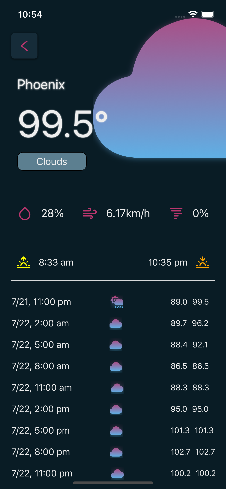

# Weather App

### Project in progress

- This is a mobile application development project for a Weather App using React-Native and Open Weather API.
- The project uses the expo CLI for initial setup and other changes to the application.

- Current Work:
  - Stack Navigation between the home screen and cite weather screen.
  - Choosing theme, colors and styles for the UI.

### Current UI progress

# Getting Started

- To run this project you will need expo in your system, so first install expo cli by following the documentation.
- Then navigate to the file and type the following : "npm install". This will install all the dependencies to your system.
- Finally to run this, you can use expo start:
  - To run on ios emulator, you will need a macOS system and xCode installed. If you have them already you can just add a simulator and run ios or type i in the CLI.
  - To run android simulator you will need android studio installed and for a macOS you will have to finish two additional steps for it to work which can be found in the expo documentation.
